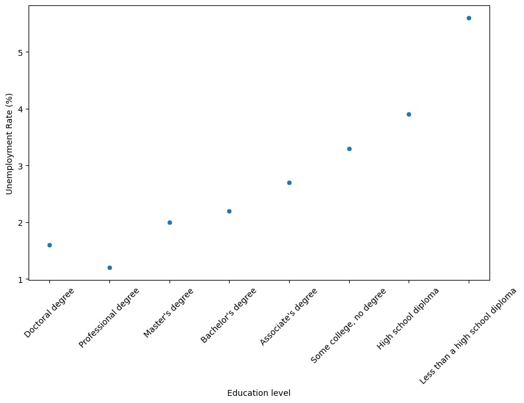

### Education & Unemployment Data Analysis (Python, Pandas, Colab)

[**Google Colab Notebook**](https://colab.research.google.com/drive/1k0AGJdvPSad92TrNB4uI_Od6lo13MoDj?usp=sharing#scrollTo=Mwam10vnfdCO)

This project explores whether higher levels of education are associated with lower unemployment rates using U.S. labor data. After cleaning and preparing the dataset in Python, I visualized the relationship with a scatter plot and performed a Pearson correlation test. The analysis found a strong negative correlation (–0.936), showing that unemployment decreases as education increases, with results statistically significant based on the low p-value. I also examined an additional dataset showing educational attainment across various occupations, revealing that management and executive roles consistently require higher degrees. The project demonstrates skills in data cleaning, visualization, statistical testing, and working with real-world datasets in Google Colab.

